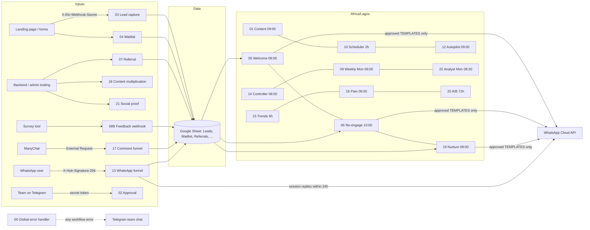
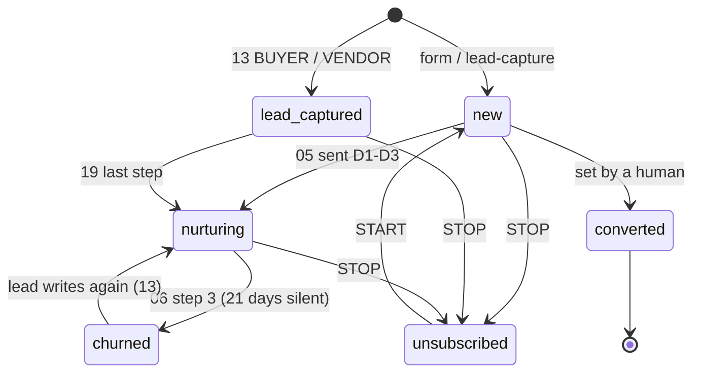
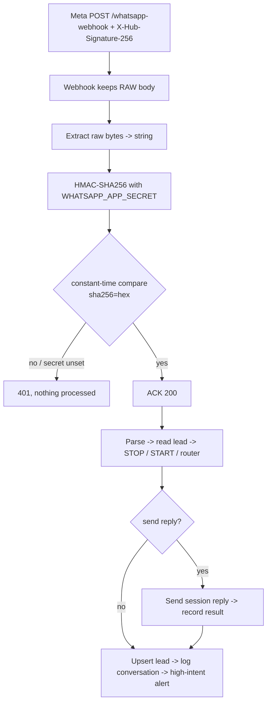
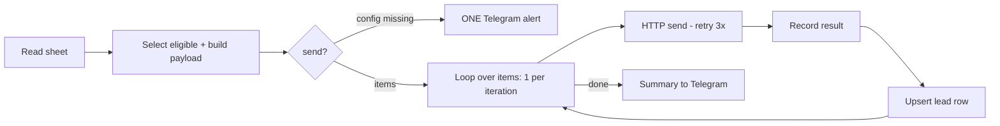

# Workflow diagrams

## System overview

## Lead lifecycle (Leads.status)

## WhatsApp signature check (workflow 13, POST)

## Bulk sender pattern (05, 06, 19, 08A, 12-Buffer)

Why a loop: n8n's retry-on-fail re-runs the whole node. Without the loop, one failing lead makes every lead that already succeeded get the message again (regression-tested: 5 requests, not 9).
