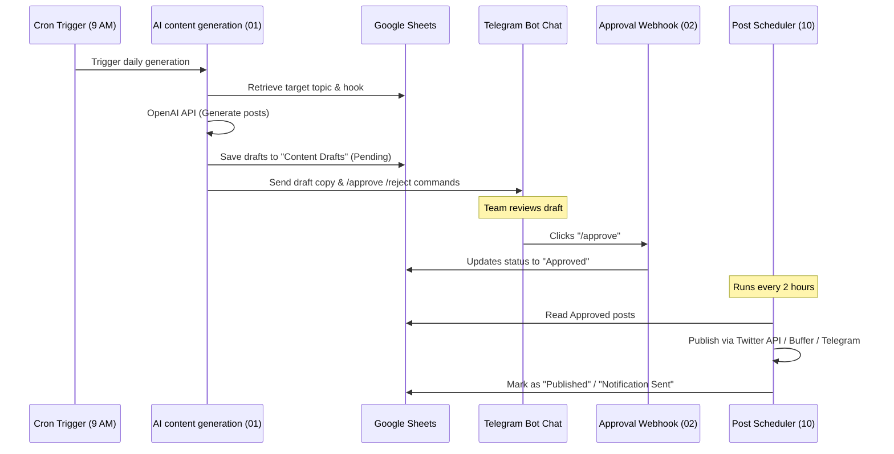
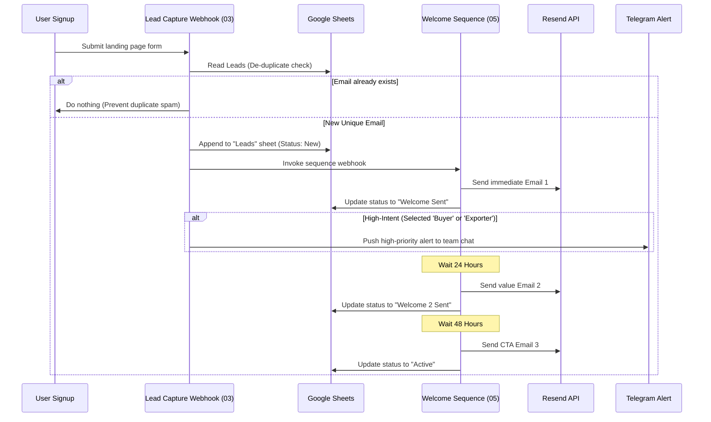

# n8n Workflow Architecture Diagrams — Eki System

This document outlines the visual structure and connections of the Eki launch automation system. It uses Mermaid formatting to map the logical flow of content approval, lead management, email triggers, and weekly analytics reporting.

---

## 1. Complete System Data Map

The following flowchart shows how users flow from capture webhooks through email onboarding, referral loops, and feedback request cycles, alongside the automated AI content approval mechanism.

```mermaid
flowchart TD
    %% Database
    GS[(Google Sheets Database)]

    %% Content Engine
    subgraph ContentEngine ["1. Content & Approval Engine"]
        cron1["⏰ Daily Cron 9 AM"] --> node01["🤖 AI content generation (01)"]
        node01 -->|Fetch Calendar Topic| GS
        node01 -->|Write drafts| GS
        node01 -->|Send Notification| bot1["💬 Telegram Approval Request"]
        bot1 -->|User click approve/reject| web1["🔗 Approval Webhook (02)"]
        web1 -->|Update draft status| GS
        web1 -->|Approved Queue| node10["📤 Social Post Scheduler (10)"]
        node10 -->|API Post| tw["🐦 Twitter/X API"]
        node10 -->|API Post| buf["📦 Buffer API"]
        node10 -->|Manual Fallback| bot2["💬 Telegram Post Alert"]
        bot2 -->|Post manually| TikTok/Reddit
    end

    %% Lead Acquisition
    subgraph LeadAcquisition ["2. Lead & Waitlist Management"]
        form["📋 Landing Page / Signup Form"] --> web2["🔗 Lead Capture Webhook (03)"]
        web2 -->|De-duplicate Check| GS
        web2 -->|Add new lead| GS
        web2 -->|Trigger Onboarding| node05["📧 Welcome Email Sequence (05)"]
        web2 -->|High-intent tag| bot3["💬 Telegram High-Intent Alert"]

        waitlist_form["📝 Waitlist Sign-up Form"] --> web3["🔗 Waitlist Webhook (04)"]
        web3 -->|Save waitlist record & referral code| GS
        web3 -->|Send Position Details| resend1["✉️ Resend Confirmation Email"]
    end

    %% Email & Engagement sequences
    subgraph EngagementEngine ["3. Onboarding & Engagement Loops"]
        node05 -->|Resend Email 1, 2, 3| user1["👤 Lead / Client"]
        user1 -->|If Inactive 7+ Days| cron2["⏰ Daily Engagement Check (06)"]
        cron2 -->|Resend re-engagement email| user1
        
        user1 -->|7 Days post-signup| cron3["⏰ Daily Feedback Trigger (08)"]
        cron3 -->|Resend survey link| user1
        feedback_webhook["🔗 Feedback Webhook (08)"] -->|Write survey response| GS
        feedback_webhook -->|Rating >= 4| review_email["📧 Resend App Review Link"]
        feedback_webhook -->|Rating <= 2| bot4["⚠️ Telegram Negative Feedback Alert"]
    end

    %% Referral Engine
    subgraph ReferralLoop ["4. Organic Referral Loop"]
        ref_click["🔗 Referral Link Signups"] --> web4["🔗 Referral Webhook (07)"]
        web4 -->|Match parent referral code| GS
        web4 -->|Increment referrer points| GS
        web4 -->|Check points threshold| node07_check{"Reached 3 or 5 points?"}
        node07_check -->|Yes| resend2["🎁 Resend Reward Notification Email"]
        node07_check -->|No| no_reward["Continue tracking"]
    end

    %% Reporting Engine
    subgraph AnalyticsEngine ["5. Weekly Analytics Reporting"]
        cron4["⏰ Monday Cron 9 AM"] --> node09["📊 Calculate Analytics (09)"]
        node09 -->|Read leads, drafts, waitlist, feedback| GS
        node09 -->|Build Snapshot HTML report| resend3["✉️ Resend HTML Report to Team"]
        node09 -->|Weekly Summary| bot5["💬 Telegram Snapshot Alert"]
        node09 -->|Log week metrics| GS
    end

    classDef sheet fill:#E3F2FD,stroke:#1565C0,stroke-width:2px;
    classDef workflow fill:#F3E5F5,stroke:#7B1FA2,stroke-width:2px;
    classDef user fill:#FFF3E0,stroke:#E65100,stroke-width:2px;
    class GS sheet;
    class node01,web1,web2,web3,node05,cron2,cron3,feedback_webhook,web4,node09,node10 workflow;
    class user1 user;
```

---

## 2. Dynamic Workflow Lifecycle Diagrams

### A. Content Generation to Posting Lifecycle

### B. Lead Capture & Engagement Lifecycle

